# 👋 Greet

I started thinking about how I could help people find a job they love and how I could help tech companies win the “war for talent”. As a result, I launched Greet. It is a marketplace where you get paid to refer your friends to tech jobs. It is an ongoing project and it currently consists of a landingpage and an admin dashboard. Both the landingpage and the admin dashboard is built with React and styled with Tailwind. Firebase is used as a database and to handle authentication.

There are currently 5 companies on board, 11 jobs posted and in total 220 000 SEK available in hiring rewards. For example, you get rewarded 25 000 SEK if you refer a frontend engineer (who gets hired) to Depict.

<strong>Try Greet:</strong> www.joingreet.com
 

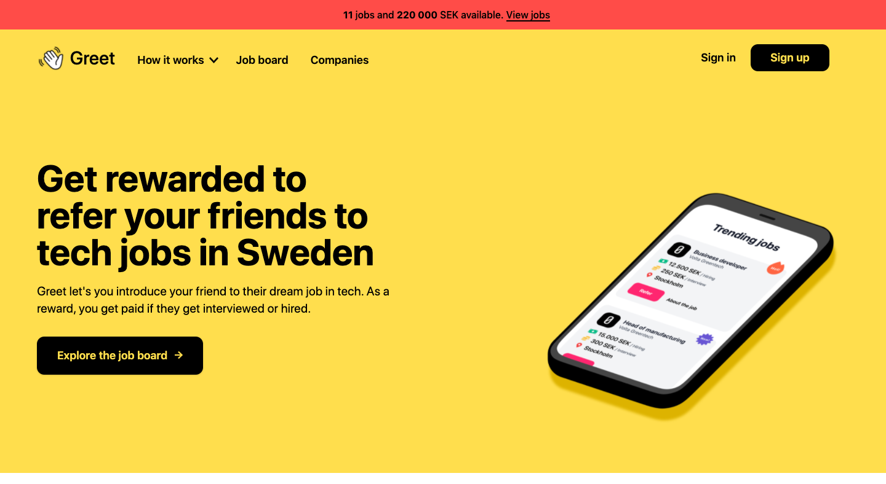   
 

## Product overview: Landingpage

The goal of the landingpage is to let “Greeters” refer their friends and for companies to sign up.
 

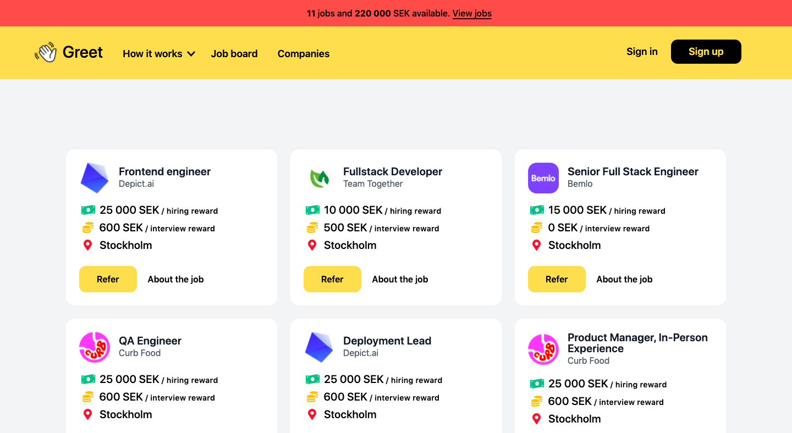
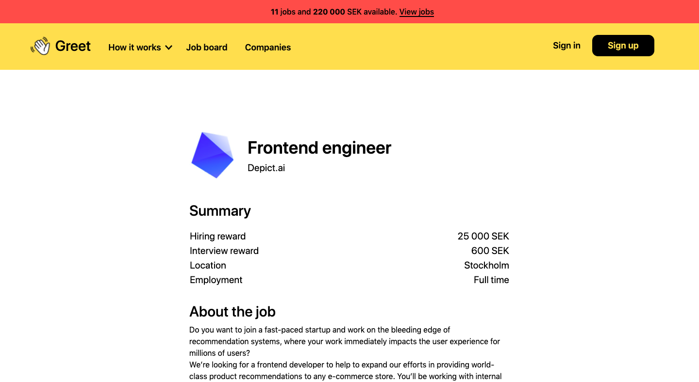
 
<em>Job board and a separate page for each job ad.</em>
 
 

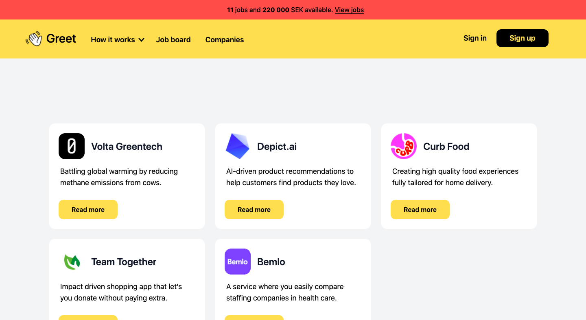
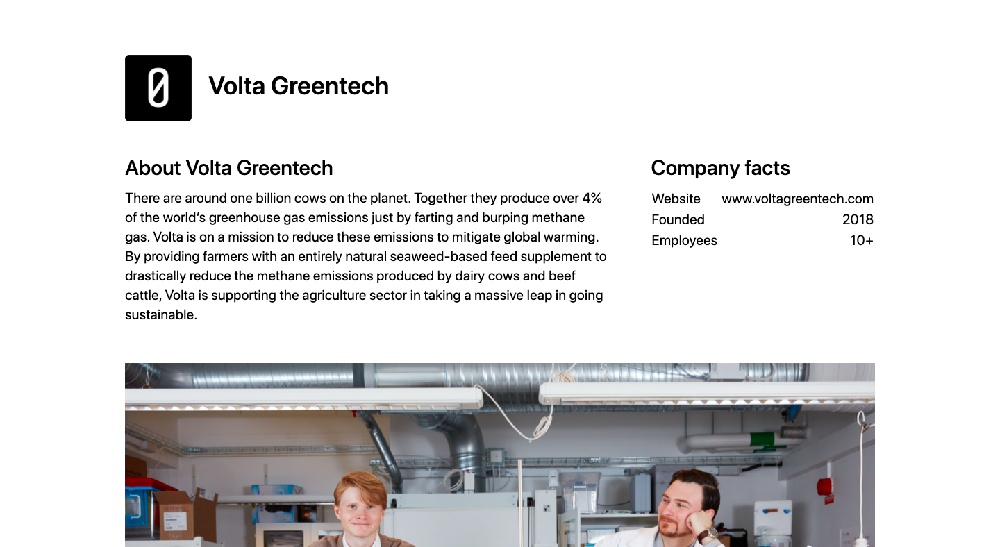
 
<em>List of companies and a separate page for each company.</em>
 
 

## How to refer a friend

 
<em>Step 1 & 2</em>
 
 

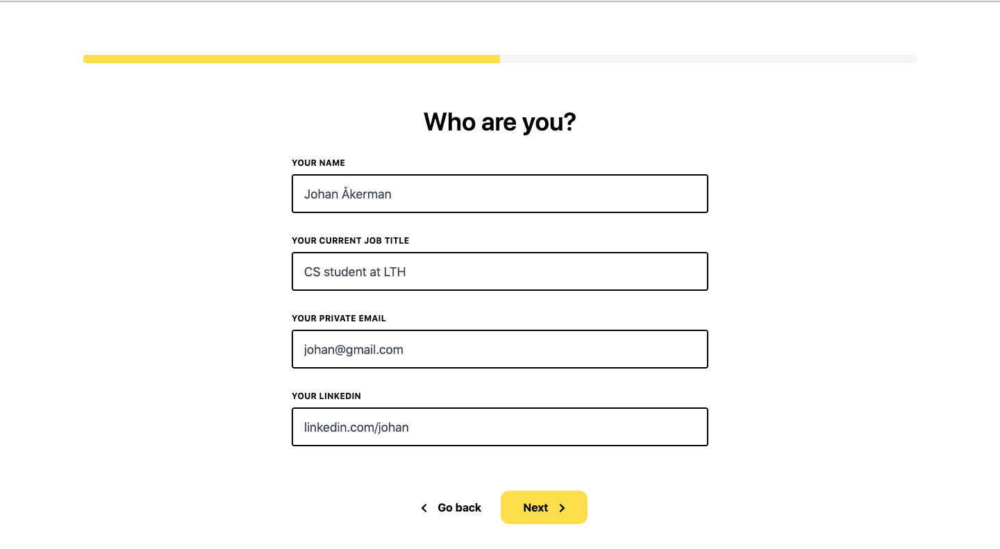

 
<em>Step 3 & 4</em>
 
 
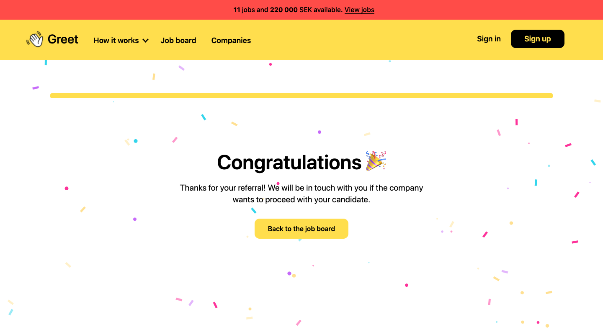  
<em>Referral complete 🥳</em>
 
 

## Product overview: Admin dashboard

The admin dashboard is only available for selected partner companies. It enables them to add / edit / delete job ads, edit their company profile and review candidates.
 

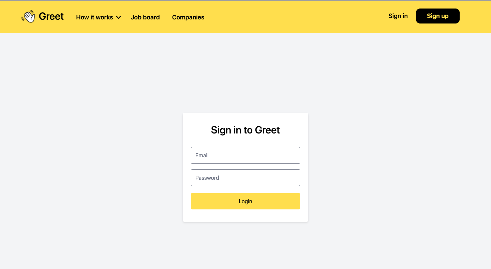
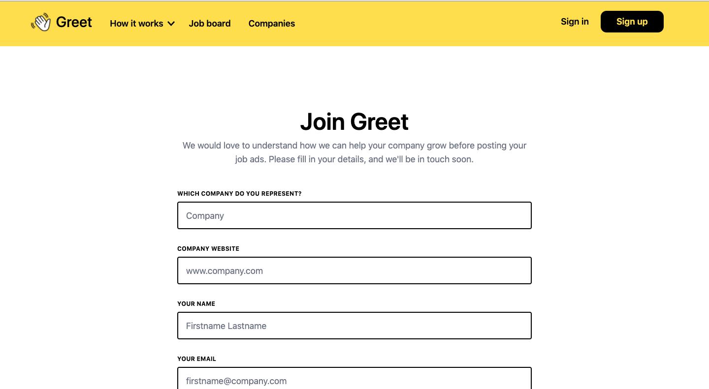
 
<em>Sign in and sign up.</em>
 
 
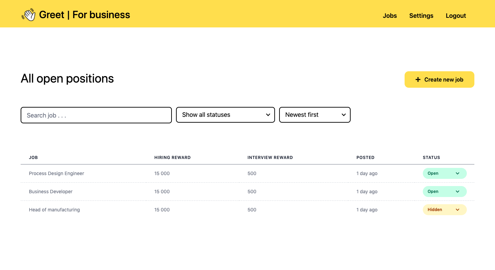  
<em>Admin homepage that displays jobs created by the current company. Click on a job to edit it and view referrals.</em>
 
 
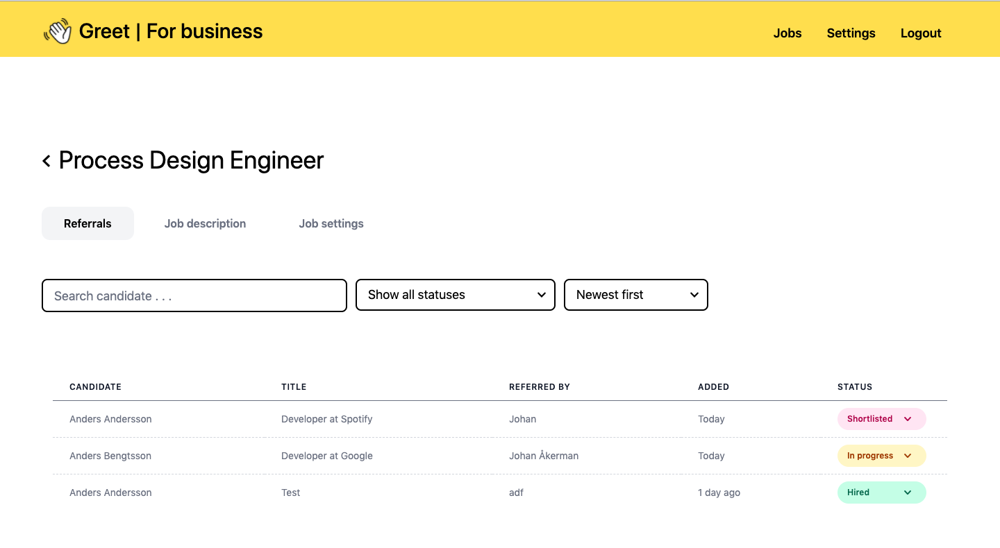
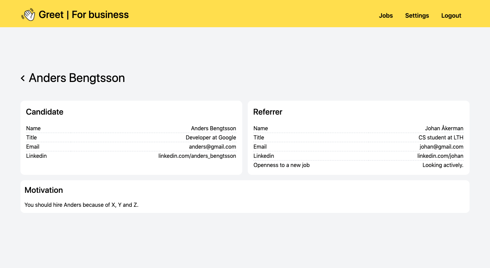
 
<em>Seperate page for each job with tabs to view referrals and to edit the job. Click on a referral to read more.</em>

 
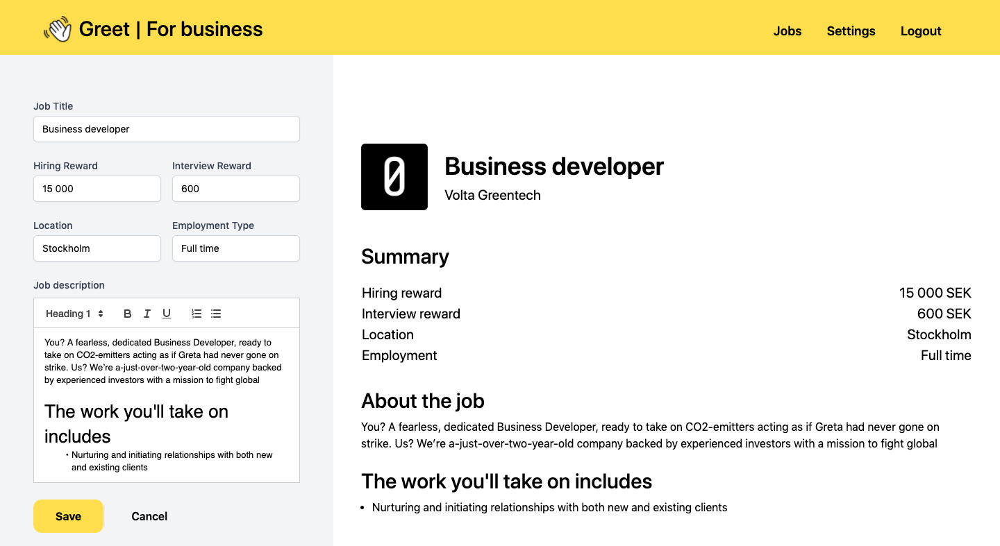  
<em>“What you see is what you get” job editor.</em>
 
 

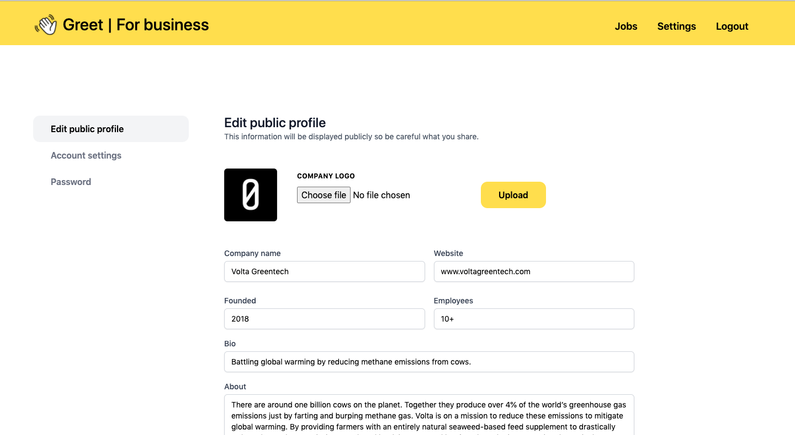
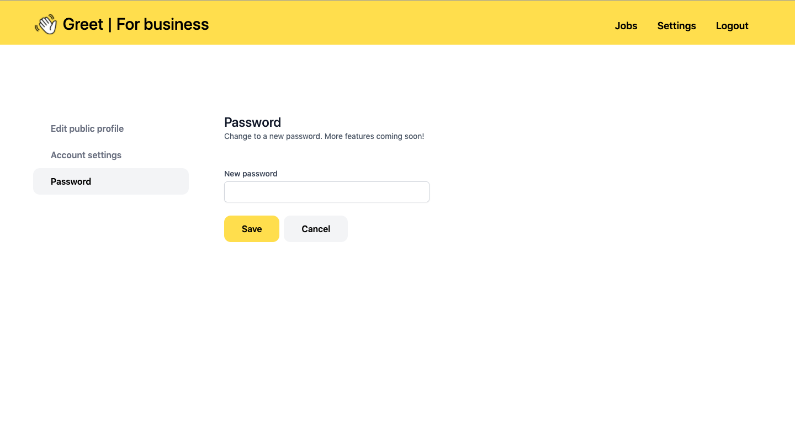
 
<em>Settings page. Tabs to edit company profile, account settings and password.</em>
 
 
