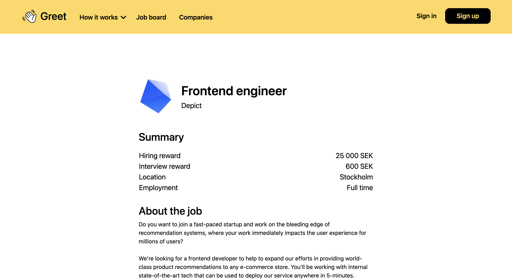

# 👋 Greet | Get rewarded to refer your friends

I discovered that hiring is a difficult, time consuming and expensive task. Especially for startups with a limited budget and no prior experience in recruiting. To solve this problem I launched Greet, a marketplace where you get paid to refer your friends to tech jobs. 6 companies joined and posted 28 jobs with a total referral bounty of 570 000 SEK. The project is no longer under development.

<strong>Try Greet:</strong> www.joingreet.com
 

   

## Technologies used

The frontend is built with React and styled with Tailwind CSS. Firebase is used as a database and to handle authentication. 
 

## Sitemap
There are three possible types of users on the site who get access to various content: users who are not logged in (orange), greeters (green) and companies (yellow).

   

## Product overview screenshots

### 1. Homepage
   

#### 1.1 Job board and job ad

	
 

#### 1.2 Companies and company profile

	
 

#### 1.3 Referral flow

   

#### 1.4 Sign in, sign up

	

### 2. Greeter view

#### 2.1 My referrals and referral page
   

#### 2.2 Leaderboard and settings

	
### 3. Company view

#### 3.1 My jobs, job page and candidate review.
   
	
#### 3.2 Job editor and settings

